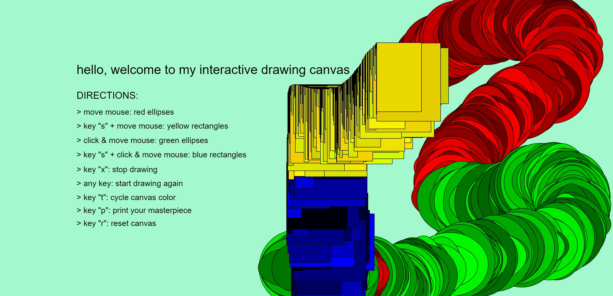

# ReadMe - HW04B Working Document

This code is used to execute a user-interactive canvas for drawing shapes. The canvas size is set to the viewport size.

This was relatively a much easier assignment to implement, as compared to the "Keeping Track of Time" one. I already had a firm idea as to what I would be doing for this, and what all functionalities I'll be including for the interactivity.

The project starts off with a white canvas, with instructions overlaid. The code generates two types of shapes: *ellipses* and *rectangles*, but with varying dimensions and color.

The functionalities are:

**1. if (user moves the mouse)**
* generate ellipses of random proportions, and in different shades of red
* or if (user keeps the *s* key pressed)
  - generate rectangles of random proportions, and in different shades of yellow

**2. else if (user click & drags the mouse)**
* generate ellipses of random proportions, and in different shades of green
* if (user keeps the *s* key pressed)
  - generate rectangles of random proportions, and in different shades of blue

**3. if (user presses the *x* key)**
* stop drawing on canvas

**4. if (user presses the *t* key)**
* change the color of the canvas

**5. if (user presses the *p* key)**
* save the page as an image

**6. if (user presses the *r* key)**
* resets the canvas

The one thing I learnt while coding the above was that the mouse and/or keyboard functions are all independent of each other, in the sense, that they won't work if nested together. Similarly, I realized that the mouse/keyboard functionalities also have cetain reserved keywords, in addition to the normal functions. I've made use of those concepts to get the curser to generate rectangles instead of ellipses.

Additionally, I've made use of *random()* to make the shape dimensions different every single time, and to cycle between different shades of primary colors. The background color cycle functionality also makes use of *random()*, and I've set the range accordingly to just generate pastel colors for better visibility.

Also, for the directions, I've combined all the text-layers into a single function which is then called every time *reset* or *color-cycle* is activated. This allowed me to keep the code clean, and not repeat the same stuff again and again.

An Example:

